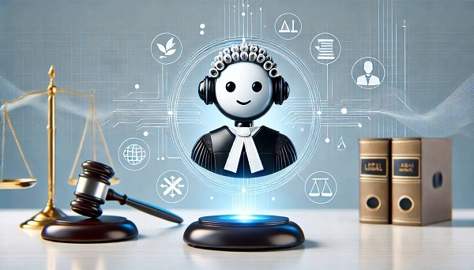

# Giới thiệu

Trong thời đại công nghệ hiện nay, việc ứng dụng công nghệ vào cuộc sống trở thành một phần không thể thiếu. Đặc biệt trong thời đại công nghệ trí tuệ nhân tạo (AI) đang bùng nổ. Mục tiêu của ứng dụng này là phát triển một hệ thống hỏi đáp về pháp luật Việt Nam. Việc ứng dụng công nghệ AI đánh dấu sự chuyển dịch lớn của ngành pháp lý từ sử dụng các công cụ, phương thức tìm kiếm thủ công sang hệ thống xử lý ngôn ngữ tự nhiên (NLP). Việc ứng dụng công nghệ xử lý ngôn ngữ tự nhiên giúp máy tính hiểu và xử lý được ngôn ngữ của con người.

# Đặt vấn đề​

Hệ thống tài liệu văn bản pháp luật rất phức tạp​. Sự phức tạp không chỉ nằm ở khối lượng dữ liệu, mà các văn bản có thể thay thế, bổ sung, hết hiệu lực, ... Trong một số trường hợp một văn bản vừa hết hiệu lực hoặc bị thay thế thì con người có thể chưa kịp cập nhật thông tin. Đặc biệt là đối với những người bận rộn. Từ đó, có thể dẫn đến những sai sót, thậm chí là thiệt hại về tài chính và rủi ro pháp lý.

Đối với ứng dụng AI thì sẽ có các điểm mạnh như sau:

- Tiết kiệm chi phí
- Hoạt động làm việc 24/7
- Phản hồi nhanh chóng
- Cập nhật thông tin thường xuyên
- Trích dẫn thông tin chi tiết

Vì AI phụ thuộc vào dữ liệu đầu vào, do việc cập nhật dữ liệu không được ngay lập tức, nên không đảm bảo tính chính xác của các văn bản pháp luật dẫn đến hạn chế và thách thức về độ chính xác của ứng dụng. Vì vậy, trong môi trường đòi hỏi sự chính xác tuyệt đối như pháp luật thì công cụ AI chỉ đóng vai trò trợ lý hỗ trợ, nguồn tham khảo và không thể thay thế con người. Do đó, để sử dụng AI hiệu quả và tránh những rủi ro sai lệch thông tin, người dùng phải kiểm chứng thông tin với chuyên gia và các CSDL chính thống trong các vấn đề mang tính quyết định.
