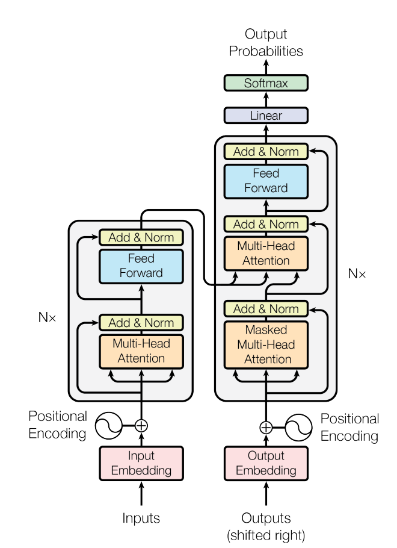
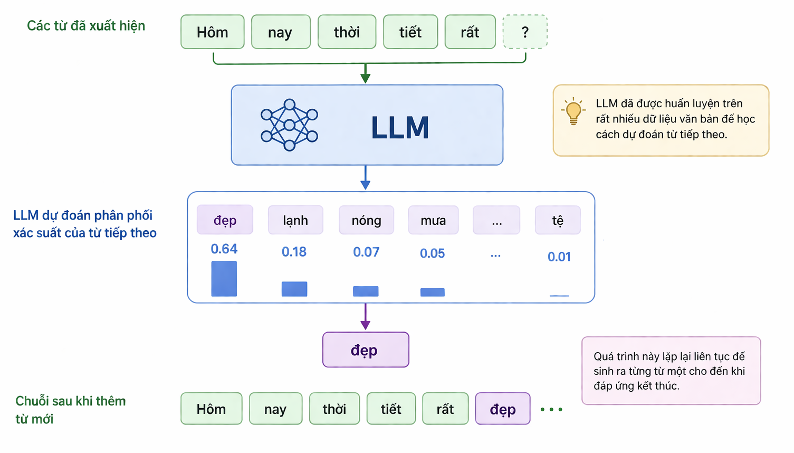
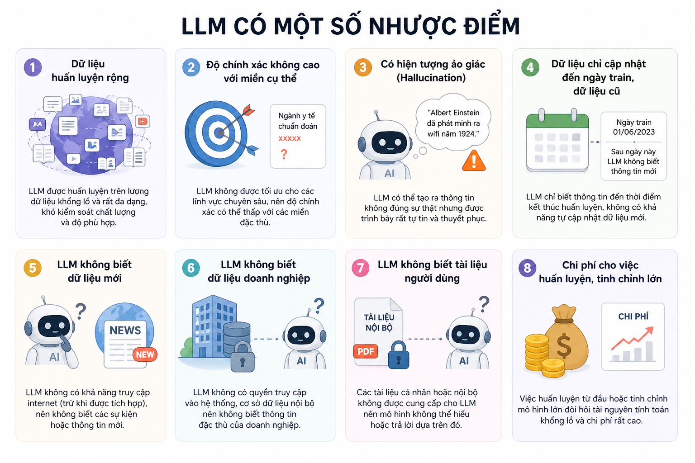

# Mô hình ngôn ngữ lớn​ LLM (Large Language Model​)

Năm 2017, các kỹ sư của Google đưa ra bài báo "Attention Is All You Need" khai sinh kiến trúc Transformer với cơ chế Self-Attention (Tự chú ý), mở đường cho hầu hết kiến trúc LLM hiện nay.

<!--  -->

Cách hoạt động của LLM là dự đoán xác suất của từ tiếp theo dựa theo các từ đã xuất hiện trước đó.

Ví dụ:

Tuy nhiên LLM có một số nhược điểm:

- Dữ liệu huấn luyện rộng

- Độ chính xác không cao với miền cụ thể​

- Có hiện tượng ảo giác (Hallucination)

- Dữ liệu chỉ cập nhật đến ngày train, dữ liệu cũ

- LLM không biết dữ liệu mới

- LLM không biết dữ liệu doanh nghiệp

- LLM không biết tài liệu người dùng

- Chi phí cho việc huấn luyện, tinh chỉnh lớn.​

