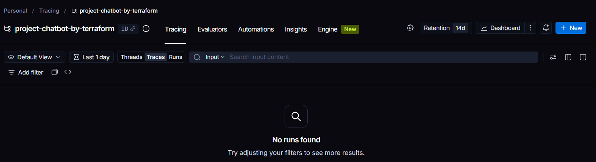
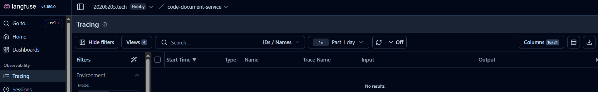

# Tạo tăng cường truy xuất RAG (Retrieval Augmented Generation)

Mô hình ngôn ngữ lớn có thể đưa ra kết quả không chính xác trong thực tế, đối mặt với thách thức như hiểu được lập luận pháp lý phức tạp, đảm bảo tính minh bạch và tránh các phản hồi gây hiểu nhầm. Làm thế nào để mô hình ngôn ngữ lớn có thể trả lời các câu hỏi pháp luật một cách chính xác?​

> Trong phạm vi đồ án này, em sử dụng RAG để tăng cường khả năng truy xuất tri thức từ các văn bản pháp luật, giúp mô hình ngôn ngữ lớn đưa ra câu trả lời chính xác hơn, có căn cứ pháp lý rõ ràng và giảm thiểu hiện tượng hallucination so với mô hình LLM truyền thống. Thay vì “đoán”, LLM sẽ dựa vào dữ liệu thật từ đó cung cấp nguồn dẫn chứng rõ ràng cho người dùng.

<!-- ## Sơ đồ RAG -->

<!--  -->

<!--  -->

<!-- Đúng, đủ -->
<!-- Chuẩn xác -->

<!-- SUY LUẬN -->
<!-- Không ảo giác -->

Tuy nhiên RAG đơn giản thì độ chính xác chưa cao và vẫn có thể sai sót vì vậy em sử dụng LangGraph xây dựng Agentic RAG để tăng độ chính xác và hạn chế ảo giác vì miền tư vấn pháp luật yêu cầu độ chính xác cao.

LangChain cung cấp các khối xây dựng cơ bản như lời nhắc, mô hình, bộ nhớ và bộ truy xuất để kết hợp thành các quy trình tuyến tính.

LangGraph mô hình hóa các ứng dụng AI dưới dạng đồ thị cho phép các tác nhân lặp lại, phân nhánh, đánh giá kết quả và duy trì trạng thái trung tâm, làm cho nó trở nên lý tưởng cho các hệ thống đa tác nhân.

LangSmith và Langfuse cung cấp khả năng theo dõi và phân tích để gỡ lỗi, theo dõi việc sử dụng token và đánh giá hiệu suất.

Lý thuyết LangGraph

Thay vì chạy theo một chuỗi tuyến tính, LangGraph mô tả luồng công việc như một mạng lưới gồm:

- Nodes (Nút): Đại diện cho các bước, tác vụ (tasks) hoặc hành động cụ thể (ví dụ: gọi LLM, tìm kiếm cơ sở dữ liệu, chào người dùng).
- Edges (Cạnh): Định nghĩa luồng di chuyển giữa các node. Edges có thể là đường đi trực tiếp hoặc có điều kiện (conditional edges - dựa trên kết quả của node trước để quyết định đi tiếp đến node nào).
- Cycles (Vòng lặp): Đây là tính năng quan trọng nhất. Khác với kiến trúc DAG (Đồ thị có hướng không chu trình) thông thường, LangGraph cho phép agent quay lại các node trước đó để thực hiện lại, tự sửa lỗi, hoặc lặp lại quy trình (iterative process) cho đến khi đạt mục tiêu.

Sơ đồ Agentic RAG dự án này:

https://github.com/20206205Tech/code-chatbot-service/blob/main/docs

Giải thích sơ đồ Agentic RAG:
