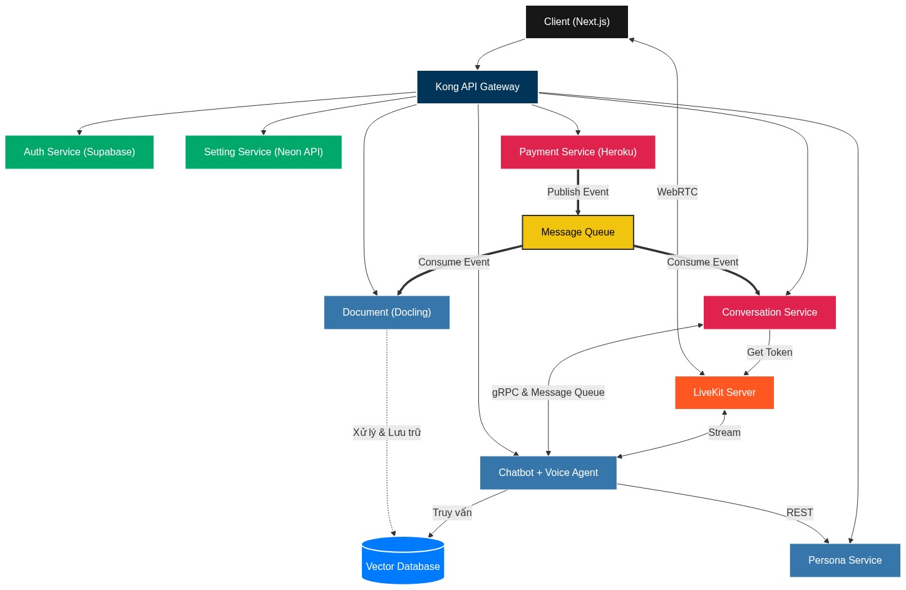

# Kiến trúc vi dịch vụ MSA (Microservice Architecture)

Kiến trúc vi dịch vụ chia bài toán thành các thành phần nhỏ hơn được gọi là các dịch vụ.

- Mỗi dịch vụ tập trung vào một khả năng kinh doanh cụ thể.

- Các dịch vụ độc lập và giao tiếp với nhau thông qua hạ tầng mạng.

Một số lợi ích của Microservice:

- Đa dạng ngôn ngữ lập trình khác nhau
- Phân chia tải nguyên tài nguyên (Heroku giới hạn RAM, AI GPU)
- Không cần cài thư viện, phụ thuộc với service không dùng => giảm độ nặng
- Biến bí mật email, ai, tải file, ...
- Giảm thời gian quá trình test vì mỗi service có nghiệp vụ khác nhau
- Kết hợp với Domain Driven Design tăng khả năng mở rộng hệ thống
- Vì các service độc lập => dễ dàng deploy

Kiến trúc tổng quan các service của dự án:

