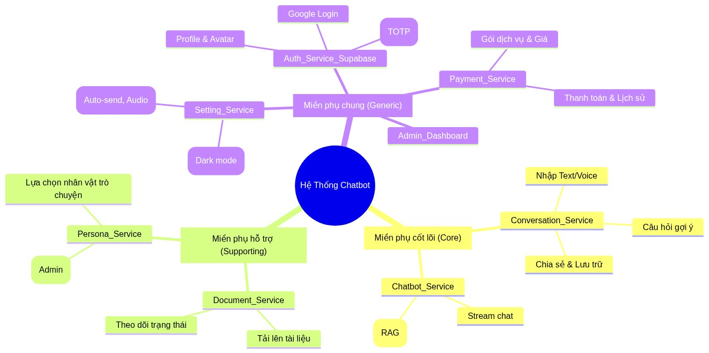

# Chức năng hệ thống

Hệ thống hỗ trợ người dùng hỏi đáp pháp luật Việt Nam, phân tích tài liệu, hợp đồng và đàm thoại trực tiếp thời gian thực với trợ lý ảo pháp lý. Dựa trên thiết kế hướng miền (DDD), bài toán lớn được chia làm các miền phụ (Subdomain) với các chức năng như sau:

## Miền phụ cốt lõi (Core Subdomain)

- Miền phụ cốt lõi là phần quan trọng và có giá trị nhất của hệ thống. Miền phụ cốt lõi giúp phân biệt các doanh nghiệp và làm cho các doanh nghiệp có giá trị. Miền phụ cốt lõi tập trung vào mục tiêu và yêu cầu của khách hàng với doanh nghiệp, từ đó quyết định sự thành công của doanh nghiệp. Vì vậy, mỗi doanh nghiệp luôn tìm cách thực hiện những điều khác biệt trong các miền phụ cốt lõi này để đạt được lợi thế so với đối thủ cạnh tranh.
  - [x] Dịch vụ trò chuyện (conversation service)
    - [x] Nhập văn bản bằng text hoặc micro
    - [x] Chức năng đàm thoại Voice
    - [x] Lưu cuộc trò chuyện theo thư mục và ghi chú
    - [x] Chia sẻ cuộc trò chuyện
  - [x] Dịch vụ chatbot (chatbot service)
    - [x] Tương tác giao tiếp với conversation service
    - [x] Lấy thông tin về lịch sử trò chuyện
    - [x] Lấy thông tin chi tiết trò chuyện

## Miền phụ hỗ trợ (Supporting Subdomain)

- Các miền phụ cốt lõi phụ thuộc vào các miền phụ hỗ trợ. Miền phụ hỗ trợ cung cấp các dịch vụ để miền phụ cốt lõi hoạt động hiệu quả. Tuy nhiên, miền phụ hỗ trợ không đòi hỏi mức độ phức tạp cao về logic nghiệp vụ.
  - [x] Dịch vụ văn bản (document service)
    - [x] Tải lên file tài liệu văn bản
    - [x] Lấy thông tin trạng thái văn bản
  - [x] Dịch vụ nhân vật (persona service)
    - [x] Người dùng lựa chọn nhân vật để trò chuyện
    - [x] Quản lý nhân vật (cần vai trò ADMIN)
    - [x] Quản lý giọng nói (cần vai trò ADMIN)

## Miền phụ chung (Generic Subdomain)

- Miền phụ chung cung cấp các giải pháp có sẵn mà doanh nghiệp có thể mua. Miền phụ chung có thể được tìm thấy trên nhiều ngành. Doanh nghiệp không thể đạt được bất kỳ lợi thế cạnh tranh so với đối thủ bằng cách thực hiện những điều khác biệt trong miền phụ chung.
  - [x] Dịch vụ xác thực (auth service - dùng supabase)
    - [x] Người dùng đăng ký, đăng nhập bằng email hoặc đăng nhập bằng Google
    - [x] Người dùng xem thông tin cá nhân và cập nhật tên, cập nhật ảnh avatar
    - [x] Người dùng có thể đổi mật khẩu hoặc dùng quên mật khẩu
    - [x] Xác thực 2FA bằng TOTP (cần thiết vì dữ liệu pháp luật cần bảo mật)
  - [x] Dịch vụ cài đặt (setting service - dùng neon api)
    - [x] Lưu thông tin nhân vật giọng nói
    - [x] Bật tắt giao diện Dark mode
    - [x] Bật tắt câu hỏi gợi ý
    - [x] Bật tắt Tự động hiển thị các bước suy luận RAG trong cuộc trò chuyện
    - [ ] Bật tắt tự động gửi văn bản khi nói xong
    - [ ] Bật tắt Tự động phát âm thanh khi trả lời
    - [ ] ...
  - [x] Dịch vụ thanh toán (payment service)
    - [x] Hiển thị các gói và mức giá
    - [x] Quản lý các gói (cần vai trò ADMIN)
    - [x] Người dùng mua gói
    - [x] Lưu lịch sử giao dịch
  - [x] Chức năng Dashboard của ADMIN
    - [x] Báo cáo thông tin Data pipeline của văn bản pháp luật
    - [x] Báo cáo thông tin Data pipeline của Pháp Điển
