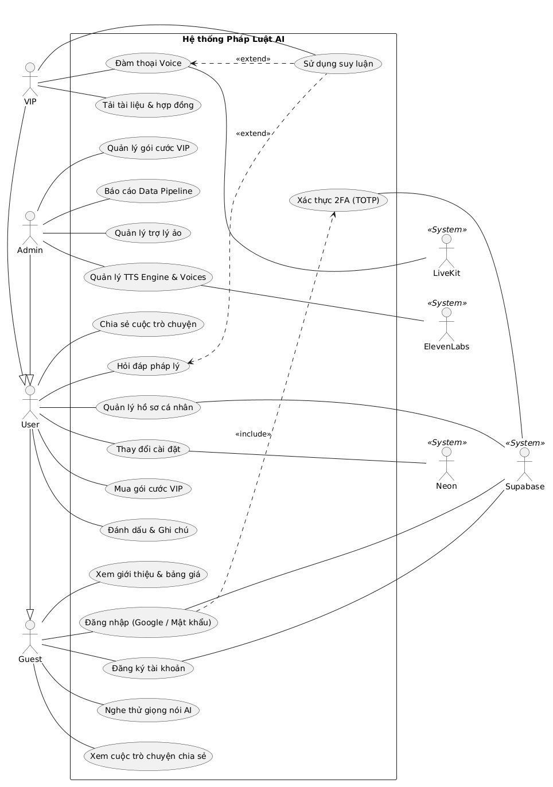
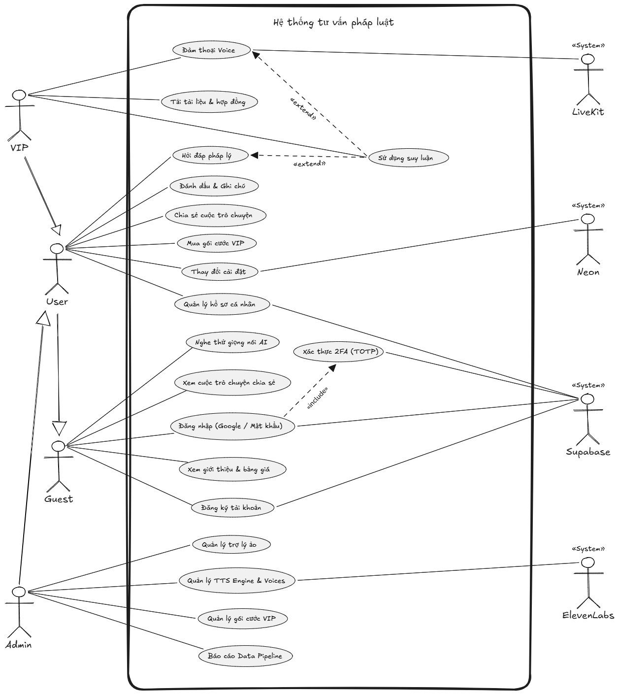
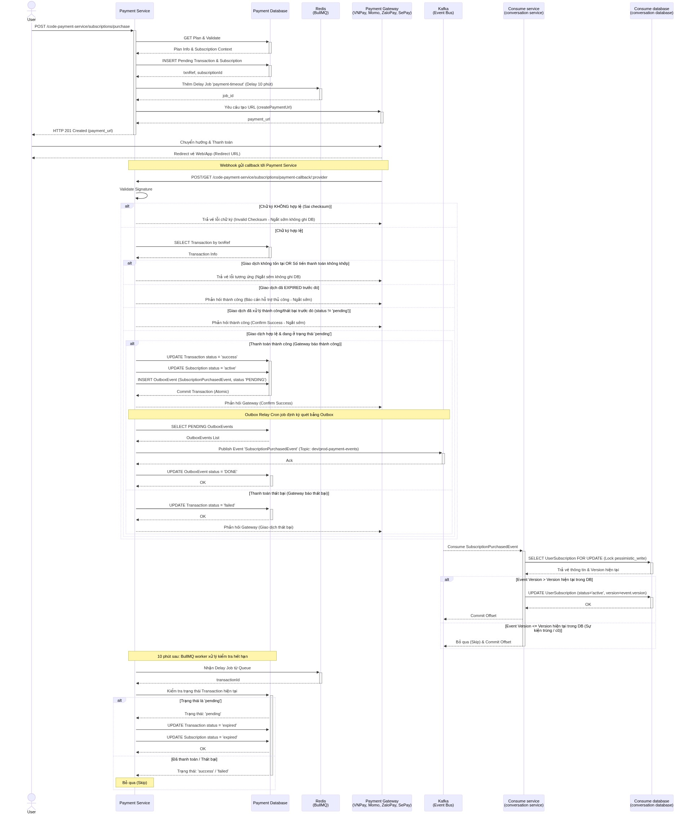
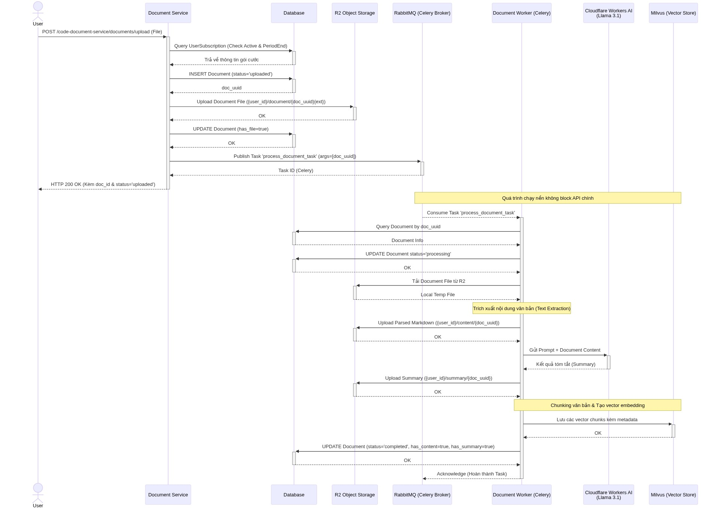
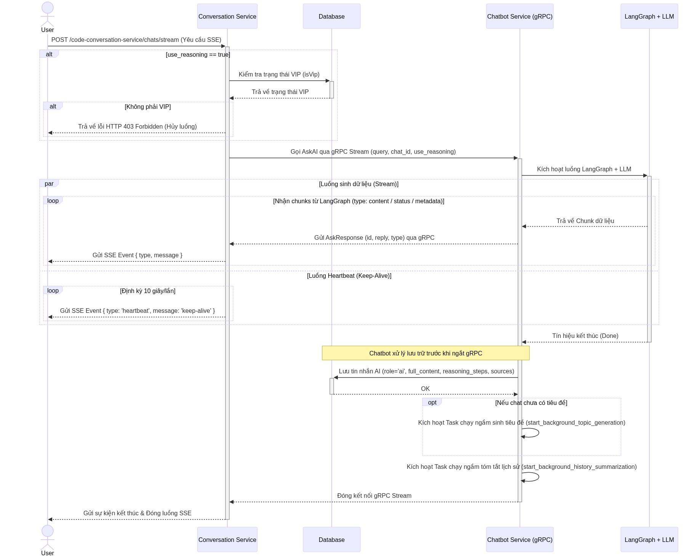
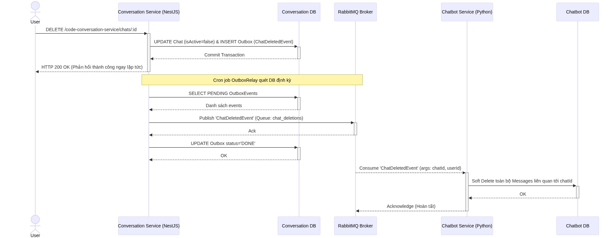
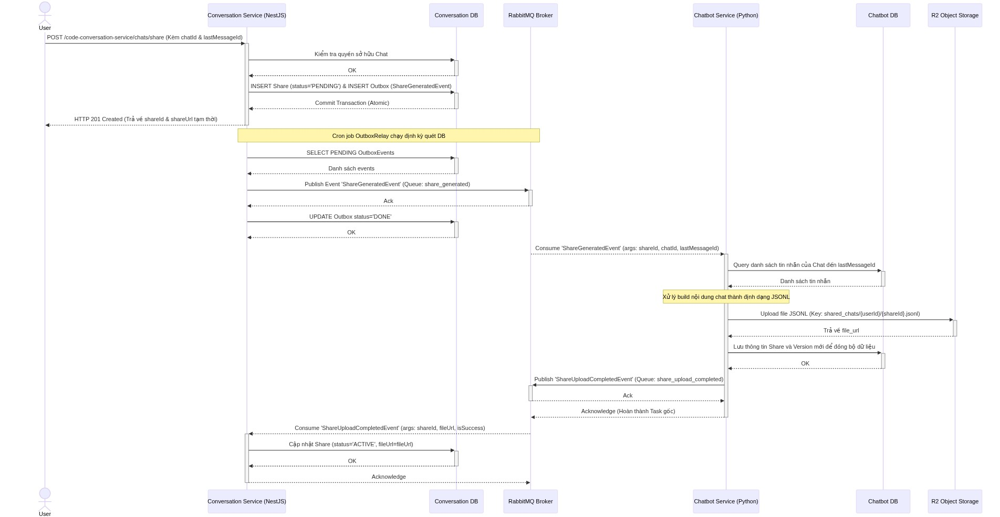
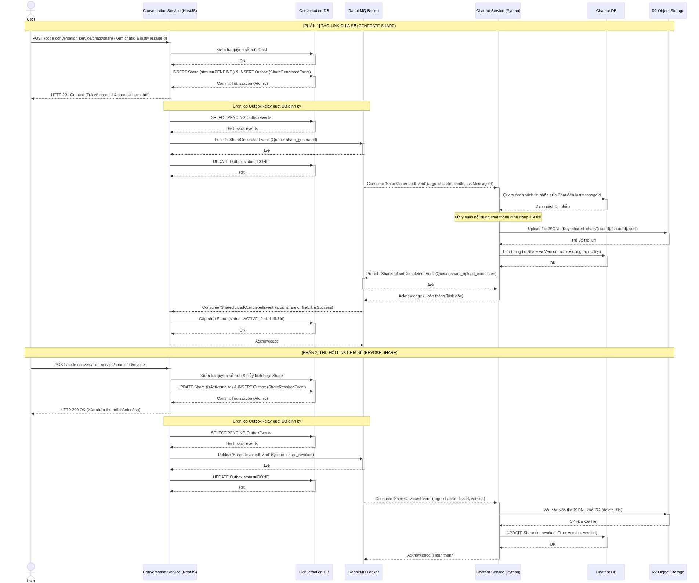

# Phân tích thiết kế hệ thống

# Sơ đồ Use Case

<!--  -->

# Sơ đồ tuần tự (Sequence Diagram)

Sơ đồ tuần tự Luồng Thanh toán và Kích hoạt gói dịch vụ

Sơ đồ tuần tự Luồng xử lý tài liệu

Sơ đồ tuần tự Luồng Hội thoại văn bản

Sơ đồ tuần tự Luồng Hội thoại giọng nói

Sơ đồ tuần tự Luồng Xóa cuộc trò chuyện

Sơ đồ tuần tự Luồng Tạo liên kết chia sẻ cuộc trò chuyện

Sơ đồ tuần tự Luồng Thu hồi liên kết chia sẻ cuộc trò chuyện
