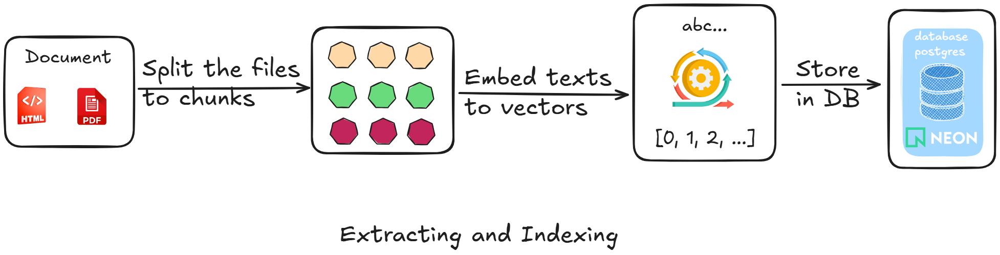
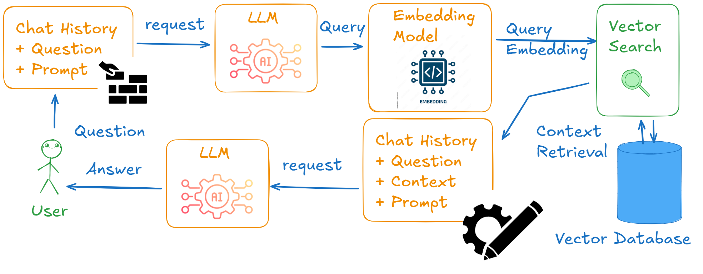

# Tạo tăng cường truy xuất RAG (Retrieval Augmented Generation)

LLM có thể đưa ra kết quả không chính xác trong thực tế, đối mặt với thách thức như hiểu được lập luận pháp lý phức tạp, đảm bảo tính minh bạch và tránh các phản hồi gây hiểu nhầm. Làm thế nào để mô hình ngôn ngữ lớn có thể trả lời các câu hỏi pháp luật một cách chính xác?​

Trong phạm vi đồ án này, em sử dụng RAG để mô hình ngôn ngữ lớn có thể trả lời các câu hỏi trong miền dữ liệu văn bản pháp luật một cách chính xác hơn. Thay vì “đoán”, LLM sẽ dựa vào dữ liệu thật từ đó cung cấp nguồn dẫn chứng rõ ràng cho người dùng.

<!-- ## Sơ đồ RAG -->

<!--  -->

<!--  -->

<!-- Đúng, đủ -->
<!-- Chuẩn xác -->

<!-- SUY LUẬN -->
<!-- Không ảo giác -->

Tuy nhiên RAG đơn giản thì độ chính xác chưa cao và vẫn có thể sai sót vì vậy em sử dụng Agentic RAG để tăng độ chính xác và hạn chế ảo giác vì miền tư vấn pháp luật yêu cầu độ chính xác cao.

-ae2ec18616941504070d6b2a7210a358.png>)

Sơ đồ Agentic RAG kết quả:

-ae2ec18616941504070d6b2a7210a358.png>)
