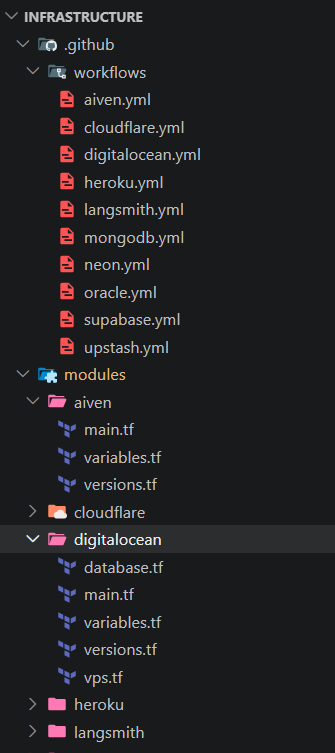

# Cơ sở hạ tầng dưới dạng mã

Trong công nghệ phần mềm việc cấu hình các cơ sở hạ tầng thủ công có thể gây sai sót, mất nhiều thời gian hoặc khi muốn tạo lại chính xác rất khó và khi cần xóa thì cũng sẽ phải ấn thủ công dẫn đến thiếu sót, gây rủi ro. Việc sử dụng Infrastructure as Code (IaC) sẽ khắc phục được vấn đề đó.

> Trong đồ án này, em sử dụng Terraform để quản lý cấu hình một số hạ tầng của các nhà cung cấp có hỗ trợ terraform giúp định nghĩa và quản lý hạ tầng của dự án một cách tự động thay vì thao tác thủ công.

Tại dự án https://github.com/20206205Tech/infra-by-terraform dùng root module lớn truyền biến vào các module nằm trong thư mục modules. Tuy nhiên việc chạy CI/CD có thể xảy ra lỗi vì provider bị lỗi, hoặc mất thời gian chỉ vì thay đổi nhỏ cần terraform init với nhiều provider không thay đổi. Vì vậy, trong đồ án này, em sử dụng mỗi provider trong folder riêng Tại dự án https://github.com/20206205Tech/infrastructure. Kết hợp github action chỉ chạy terraform khi có sự thay đổi của folder.

Cấu trúc dự án terraform với các folder riêng

<!--  -->

Sử dụng Terraform Cloud để làm Remote Backend

