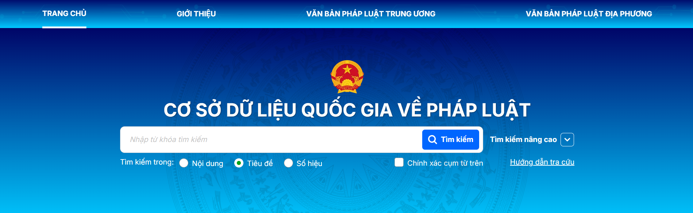
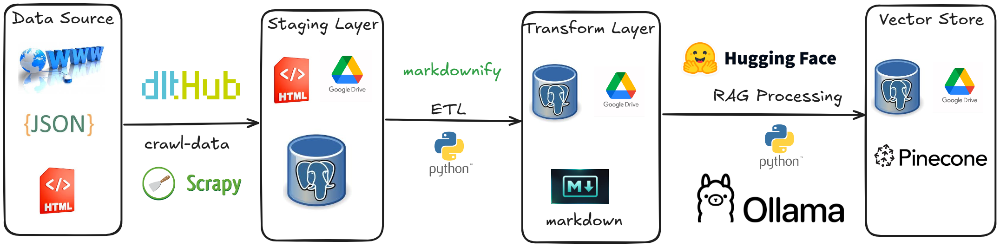
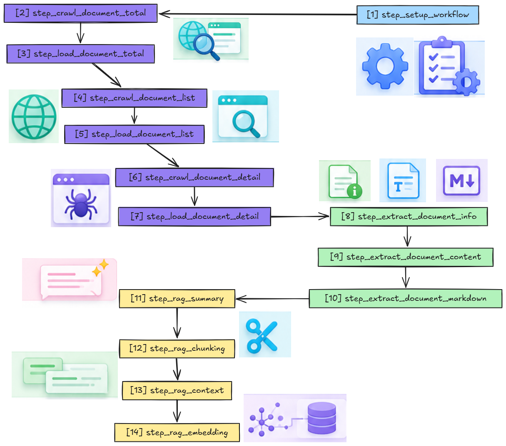
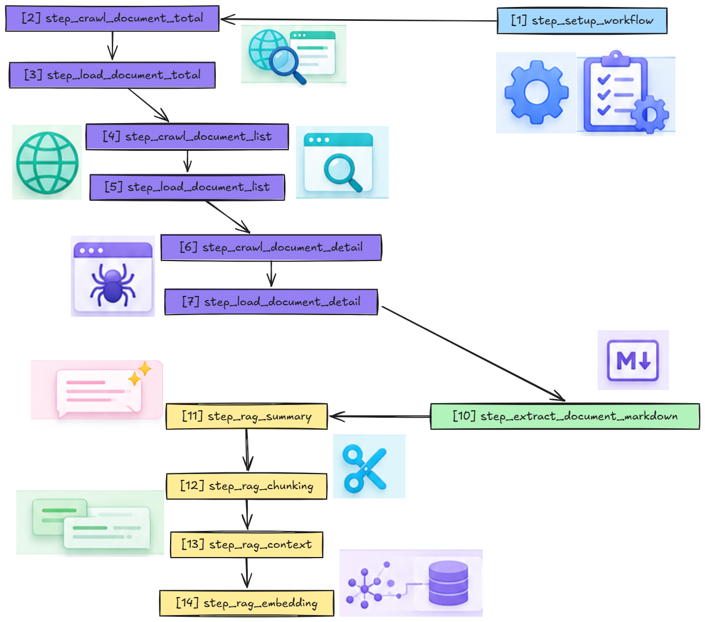

# Đường ống dữ liệu Văn bản pháp luật

Khi làm việc với bài toán dữ liệu thực tế, việc thu thập dữ liệu
có thách thức
phụ thuộc
vào nguồn
dữ liệu.
Vào ngày 24/05/2026, nguồn dữ liệu Văn bản pháp luật được thay đổi cả hệ thống, API và giao diện.
Do sự thay đổi lớn về dữ liệu thu thập
nên hệ thống cần xử lý lại các bước Data pipeline.

Giao diện nguồn dữ liệu Văn bản pháp luật mới

Sơ đồ tổng quan Data pipeline Văn bản pháp luật

Các bước thực hiện cũ

Mô tả các bước thực hiện cũ:

Quá trình Data pipeline được chia thành 3 giai đoạn: Thu thập dữ liệu, Tiền xử lý văn bản và Tích hợp RAG Pipeline.

- Giai đoạn Khởi tạo:
  - step_setup_workflow cập nhật danh sách và thứ tự các bước (workflow) vào cơ sở dữ liệu PostgreSQL

- Giai đoạn Thu thập Dữ liệu:
  - step_crawl_document_total và step_load_document_total: thu thập tổng số lượng văn bản pháp luật hiện có trên hệ thống web.
  - step_crawl_document_list và step_load_document_list: Dựa vào sự chênh lệch tổng số lượng, tính toán số trang cần quét và thu thập danh sách các item_id.
  - step_crawl_document_detail và step_load_document_detail: tải toàn bộ mã nguồn HTML trang chi tiết của từng văn bản và Upload các file HTML gốc này lên Google Drive, đồng thời lưu drive_id và mã băm MD5 hash vào database để quản lý thay đổi.

- Giai đoạn Tiền xử lý Dữ liệu:
  - step_extract_document_info: từ file HTML, bóc tách các siêu dữ liệu quan trọng (Metadata) như: Số hiệu, Cơ quan ban hành, Ngày có hiệu lực, Người ký, v.v., và lưu vào database.
  - step_extract_document_content: Làm sạch file HTML, cắt bỏ các phần thừa (header, footer, menu) và chỉ giữ lại phần nội dung (thẻ div#toanvancontent ).
  - step_extract_document_markdown: Chuyển đổi file HTML đã làm sạch sang định dạng Markdown.

- Giai đoạn Tích hợp RAG pipeline
  - step_rag_summary: Sử dụng LLM viết một bản tóm tắt ngắn gọn mô tả bức tranh toàn cảnh của văn bản pháp luật đó.
  - step_rag_chunking: Chạy Semantic Chunking. LLM sẽ dựa vào bản tóm tắt và nội dung chi tiết để quyết định các "điểm cắt" tối ưu, chia nhỏ văn bản thành các đoạn (chunks) sao cho không bị đứt gãy ý nghĩa.
  - step_rag_context: Đây là bước chống mất ngữ cảnh. LLM sẽ sinh ra ngữ cảnh cho từng đoạn chunk nhỏ vừa được cắt, đảm bảo mỗi chunk đều có thể đứng độc lập khi được tìm kiếm.
  - step_rag_embedding: Sử dụng mô hình HuggingFace ( keepitreal/vietnamese-sbert ) để biến đổi các đoạn văn bản (đã có ngữ cảnh) thành vector đa chiều và lưu trữ vào VectorDB (Pinecone).

Các bước thực hiện mới

Nhờ vào việc nguồn dữ liệu thay đổi sang hệ thống API mới
trả về cấu trúc JSON giàu thông tin, hệ thống không còn cần các bước bóc tách thủ công từ mã nguồn HTML phức tạp, giúp tăng tốc độ xử lý và độ chính xác của dữ liệu.

Hệ thống loại bỏ bước step_extract_document_info vì nội dung Metadata chi tiết đã có trong API

Hệ thống loại bỏ bước step_extract_document_content vì nội dung văn bản đã được API trả trong thông tin documentContent
