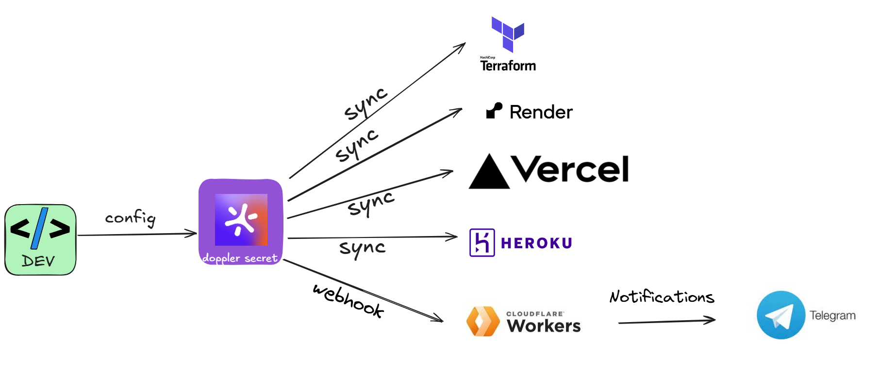
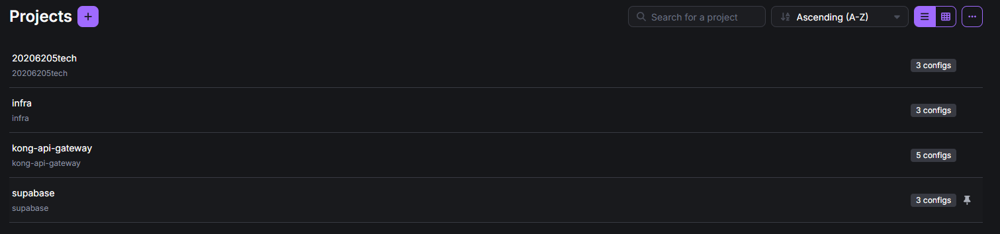

# Quản lý các thông tin bí mật (secret)

Quản lý các thông tin bí mật là một phần cực kỳ quan trọng. Đặc biệt khi hệ thống được thiết kế theo kiến trúc microservices.
Khi dự án có nhiều service, việc sử dụng file .env độc lập cho từng service sẽ gây khó khăn trong việc quản lý, cấu hình, đồng bộ và bảo mật.

> Trong đồ án này, em sử dụng Doppler để quản lý secret một cách an toàn và hiệu quả.

Sơ đồ quản lý secret bằng doppler

Cấu hình chia nhỏ bí mật theo từng nhu cầu sử dụng trong doppler

