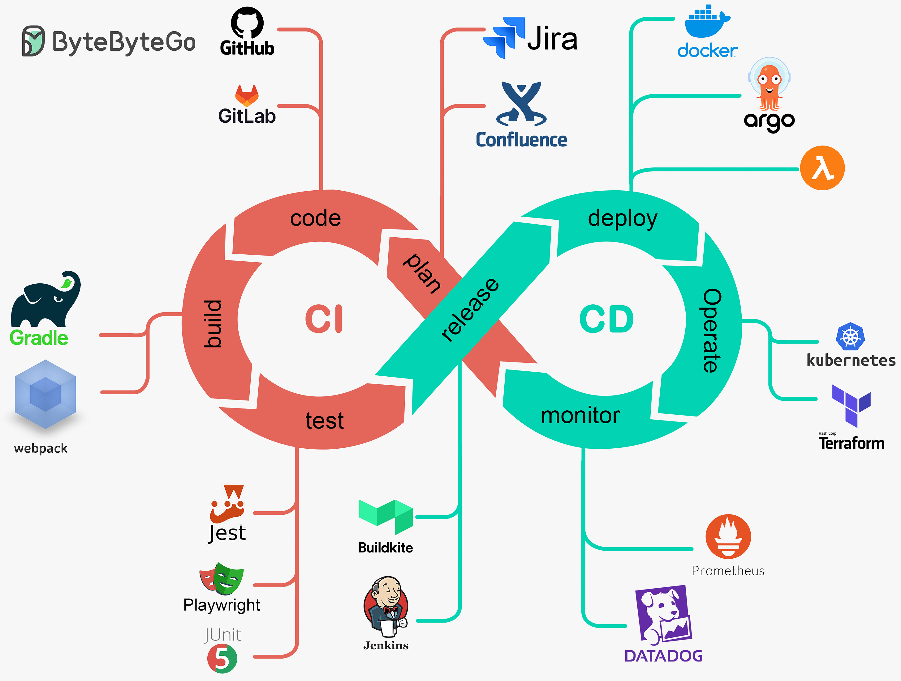

#   CI/CD bằng Github Action

CI/CD là
phương pháp tự động hóa
quy trình tích hợp
và triển khai phần mềm.
Phương pháp này giúp
đẩy nhanh tốc độ, giảm thiểu lỗi thủ công
và duy trì độ ổn định cho hệ thống.

Sơ đồ CI/CD bằng Github Action

run ubuntu
run vps elf host
