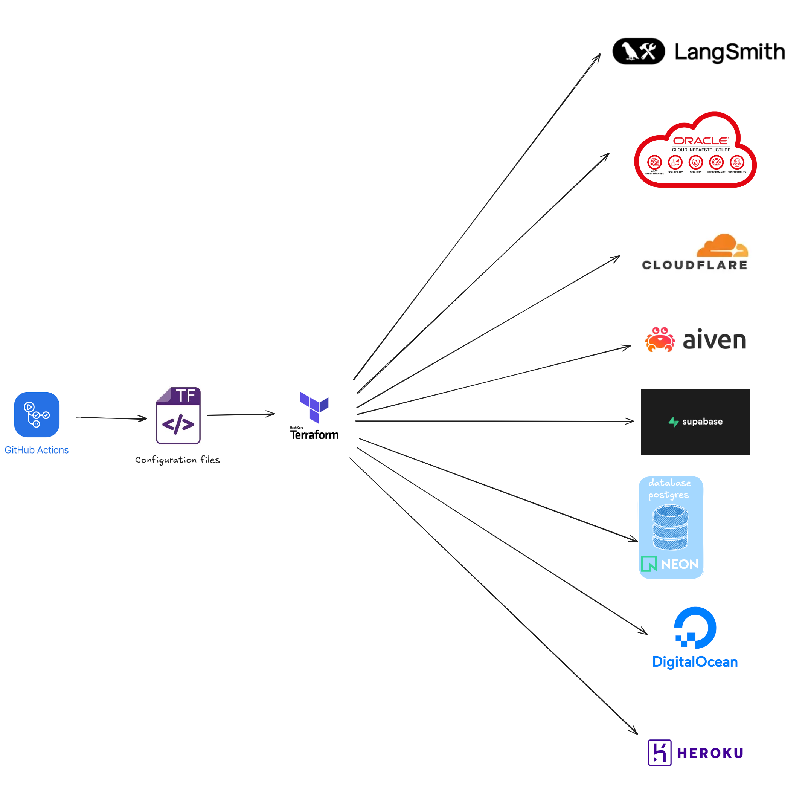
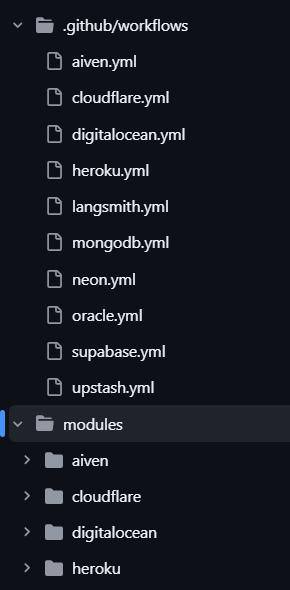
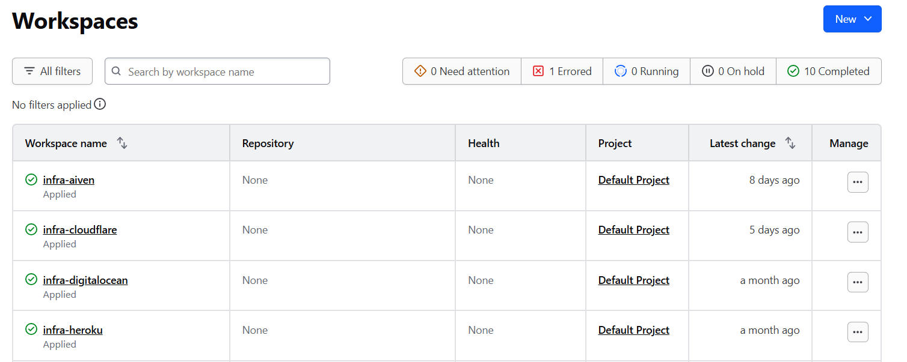

# Cơ sở hạ tầng dưới dạng mã

Trong công nghệ phần mềm việc cấu hình các cơ sở hạ tầng thủ công có thể gây sai sót, mất nhiều thời gian hoặc khi muốn tạo lại chính xác rất khó và khi cần xóa thì cũng sẽ phải ấn thủ công dẫn đến thiếu sót, gây rủi ro. Việc sử dụng Infrastructure as Code (IaC) sẽ khắc phục được vấn đề đó.

> Trong đồ án này, em sử dụng Terraform để quản lý cấu hình một số hạ tầng của các nhà cung cấp có hỗ trợ terraform giúp định nghĩa và quản lý hạ tầng của  dự án một cách tự động thay vì thao tác thủ công.

<!-- folder git -->

<!-- đánh đổi -->
<!-- kết hợp github aciton -->
<!-- không dùng modelu do có thể lỗi -->

https://github.com/20206205Tech/infrastructure

https://github.com/20206205Tech/infra-by-terraform
<!-- ảnh cloud -->

