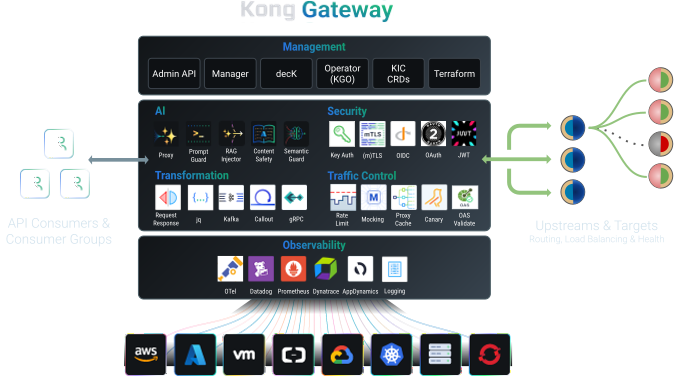
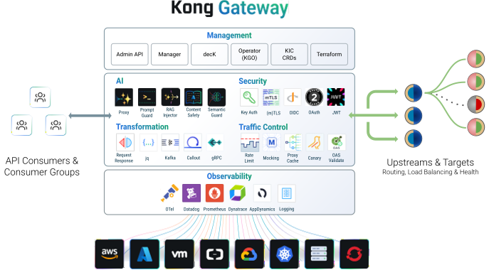
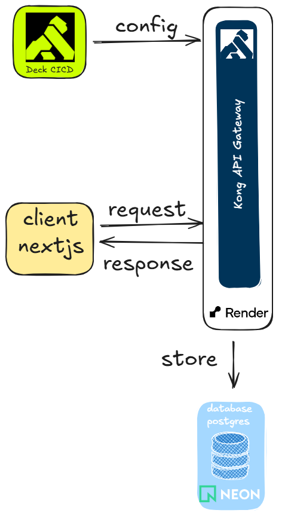
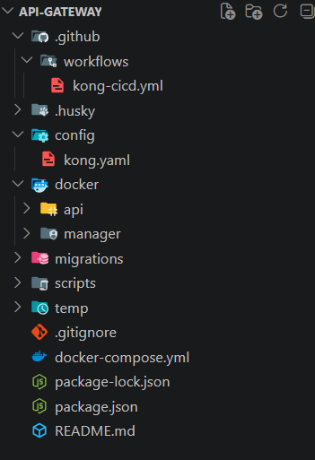

# API Gateway trong Microservice

API Gateway
được sử dụng
để quản lý và kiểm soát việc truy cập vào các API.
API Gateway cung cấp một lớp trung gian
giữa client và các microservices.
Có thể nói, API Gateway
là một điểm vào độc lập cho nhiều client của một ứng dụng.

Kong API Gateway
là một trong những API Gateway
mã nguồn mở
phổ biến
có thể quản lý các API được triển khai ở bất kỳ đâu, từ cơ sở hạ tầng đơn giản đến môi trường đa đám mây phức tạp.

<!--  -->

Sơ đồ quản lý Kong API Gateway

<!--  -->

Cấu trúc dự án Kong API Gateway

- Các kong api gateway plugins trong dự án này:

- Plugin bot-detection: phân tích User-Agent và các dấu hiệu khác để chặn các request từ các bot độc hại, scraper, hoặc các công cụ tự động không mong muốn.

- Plugin rate-limiting: giới hạn số lượng request, giúp bảo vệ các dịch vụ khỏi bị quá tải hoặc bị lạm dụng.

- Plugin request-size-limiting: chặn các request có kích thước vượt quá ngưỡng cho phép.

- Plugin http-log: thu thập các thông tin quan trọng về request/response và gửi qua giao thức http api NestJS và thực hiện lưu vào database postgres

- Plugin correlation-id tạo request-id: tự động tạo ra một mã định danh duy nhất và gắn vào header của mỗi request để truy vết (tracing).

- Plugin request-transformer thêm thông tin Request-Kong-Secret: gửi header chứa mã bí mật vào request trước khi đẩy xuống dịch vụ để các request phải được gọi từ Kong API Gateway.
