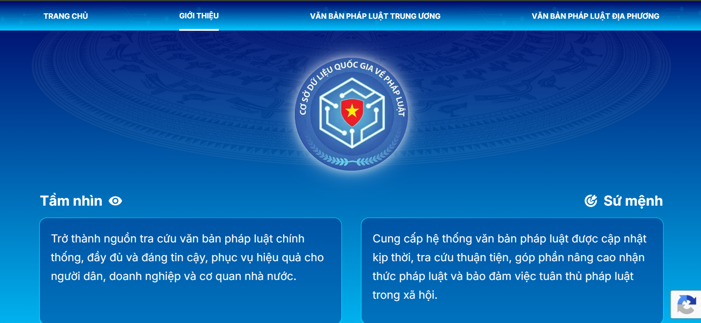
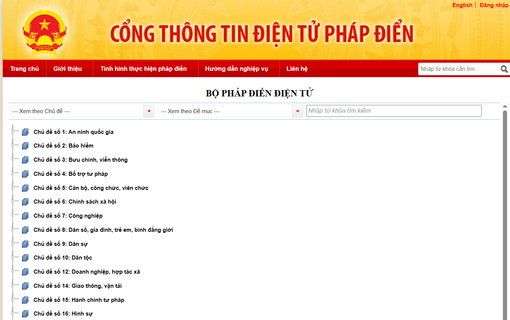

# Đường ống dữ liệu (Data pipeline)

Đường ống dữ liệu (Data Pipeline)
bao gồm các chuỗi quy trình xử lý tự động
từ một hoặc nhiều nguồn (source) đến một đích đến (destination) để lưu trữ, phân tích hoặc phục vụ cho các ứng dụng khác.

Vì dự án này làm về miền nghiệp vụ pháp luật
nên không cần thu thập dữ liệu từ nhiều nguồn khác nhau.
Em sử dụng dữ liệu chính thống từ nhà nước là **Văn bản pháp luật** tại địa chỉ https://vbpl.vn
và
dữ liệu **Pháp Điển** tại địa chỉ https://phapdien.moj.gov.vn/Pages/chi-tiet-bo-phap-dien.aspx

Giao diện nguồn dữ liệu Văn bản pháp luật

Giao diện nguồn dữ liệu Pháp Điển

Sơ đồ thu thập dữ liệu chung

Tại các bước sẽ sử dụng logic so sánh hash để bỏ qua văn bản không thay đổi nội dung
giúp tiết kiệm tài nguyên và thời gian xử lý dữ liệu.
