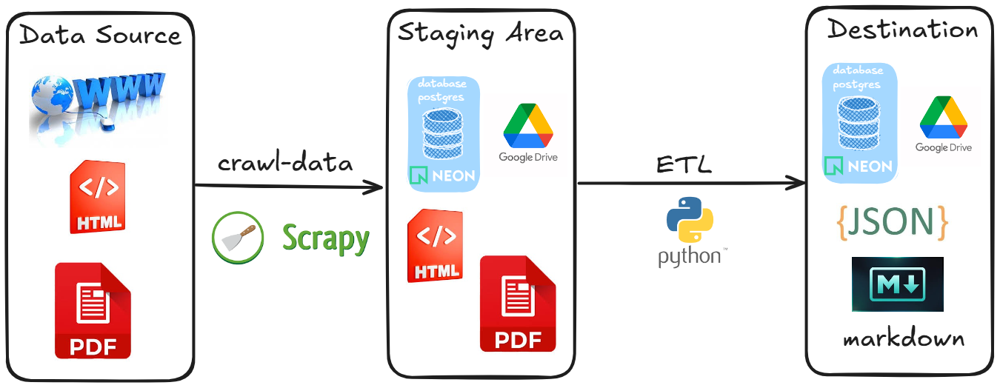

# Đường ống dữ liệu Văn bản pháp luật

Khi làm việc với bài toán dữ liệu thực tế, việc thu thập dữ liệu
có thách thức
phụ thuộc
vào nguồn
dữ liệu.
Vào ngày 24/05/2026, nguồn dữ liệu Văn bản pháp luật được thay đổi cả hệ thống và giao diện.

<!-- # Sơ đồ tiền xử lý dữ liệu ETL -->

<!-- - [ ] Trích xuất nội dung thẻ HTML -->

<!-- - [ ] Trích xuất nội dung tiêu đề số liệu, số văn bản, thời gian vị trí bên trên -->

<!-- - [ ] Trích xuất nội dung người ký bên dưới -->

<!-- - [ ] Chuyển đổi ngày tháng năm -->

<!-- - [ ] Trích xuất nội dung quan trọng ở giữa -->

<!-- - [ ] Sử dụng python để chuyển thành markdown -->

<!-- - [ ] Sử dụng langchain : Chunking và embeddings dữ liệu -->
