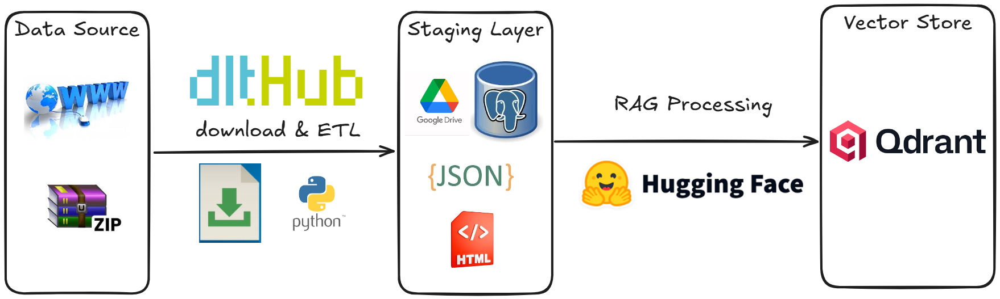
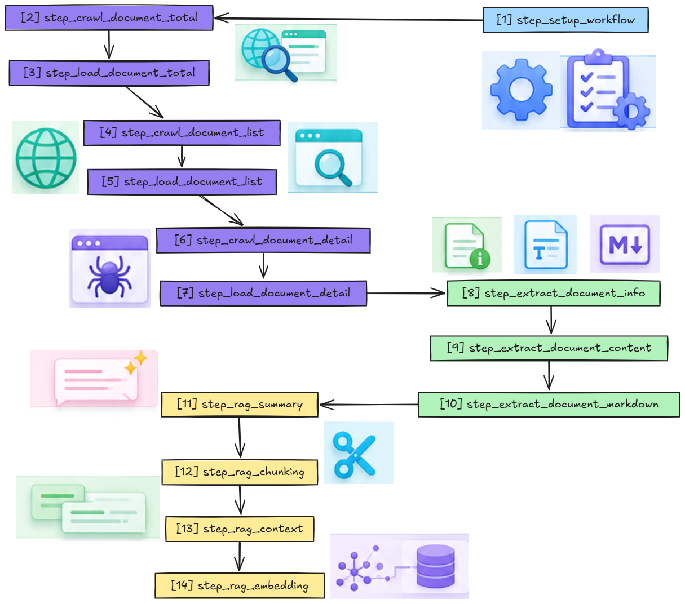

# Đường ống dữ liệu Pháp Điển

Sơ đồ tổng quan Data pipeline Pháp Điển

Các bước thực hiện

Mô tả các bước thực hiện:

Quá trình Data pipeline được chia thành 3 giai đoạn: Thu thập dữ liệu, Tiền xử lý văn bản và Tích hợp RAG Pipeline.

[step_download_zip] ──(MD5 Check)──> Giải nén HTML
│
[step_extract_json] ──> Trích xuất jdChuDe, jdDeMuc, jdAllTree.json
│
[step_load_json] ──(dlt replace)──> Đẩy dữ liệu quan hệ vào Postgres
│
[step_rag_chunking] ──> Match tọa độ cây mục lục với HTML ──> Tạo chunk JSON
│
[step_rag_embedding]──> Làm giàu ngữ cảnh (Rich Context) ──> Đẩy vào Qdrant

step_download_zip.py

step_extract_json.py

step_load_json.py

step_rag_chunking.py

step_rag_embedding.py
