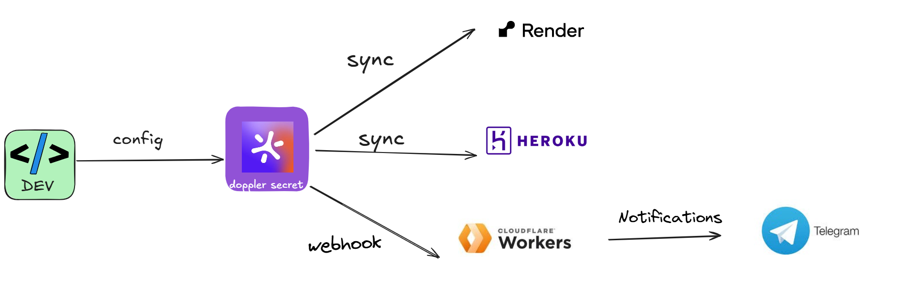
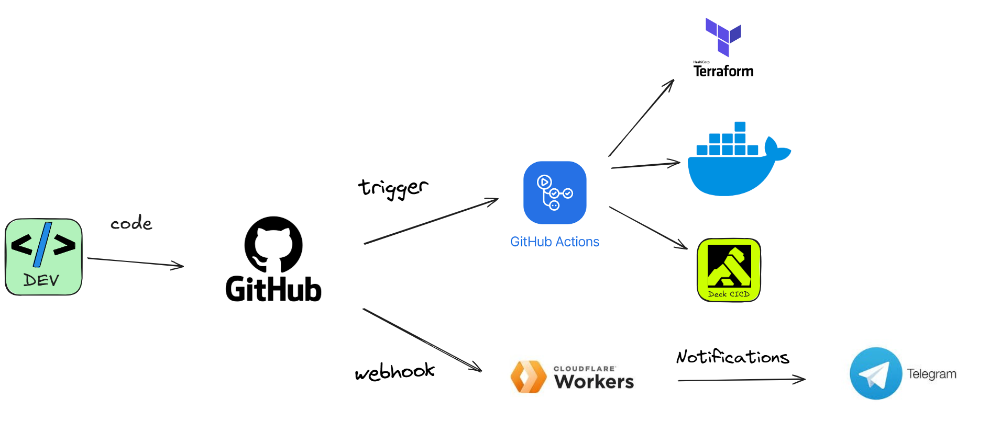
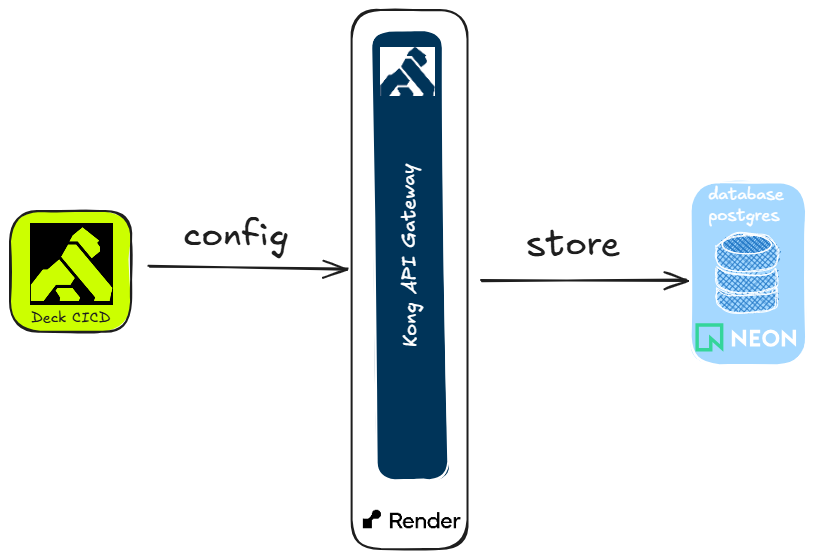
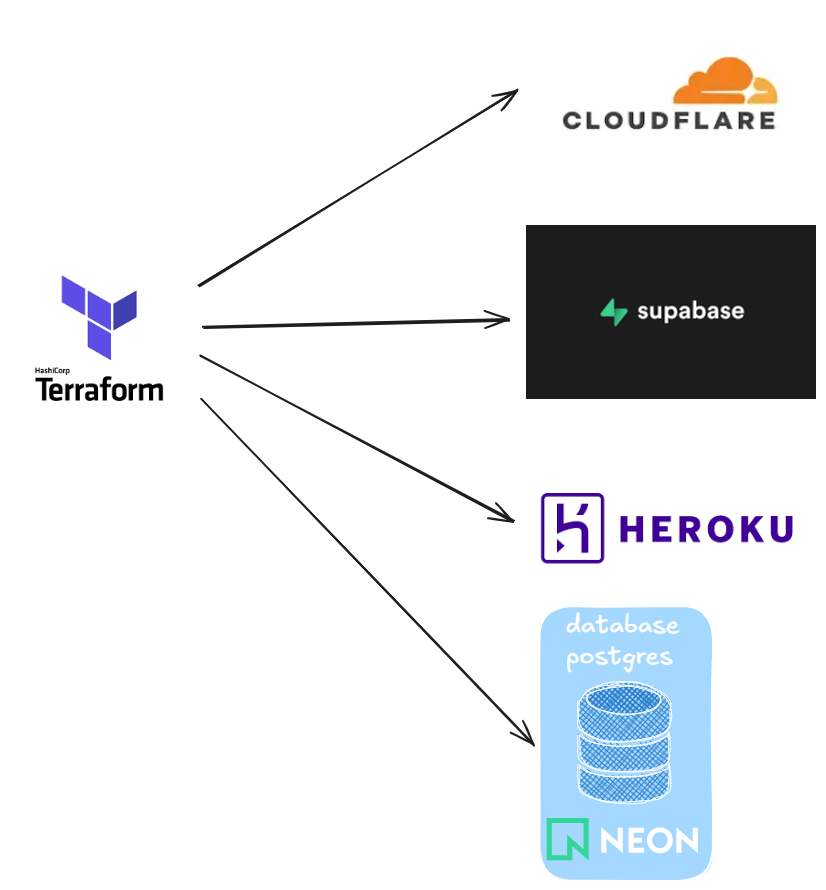
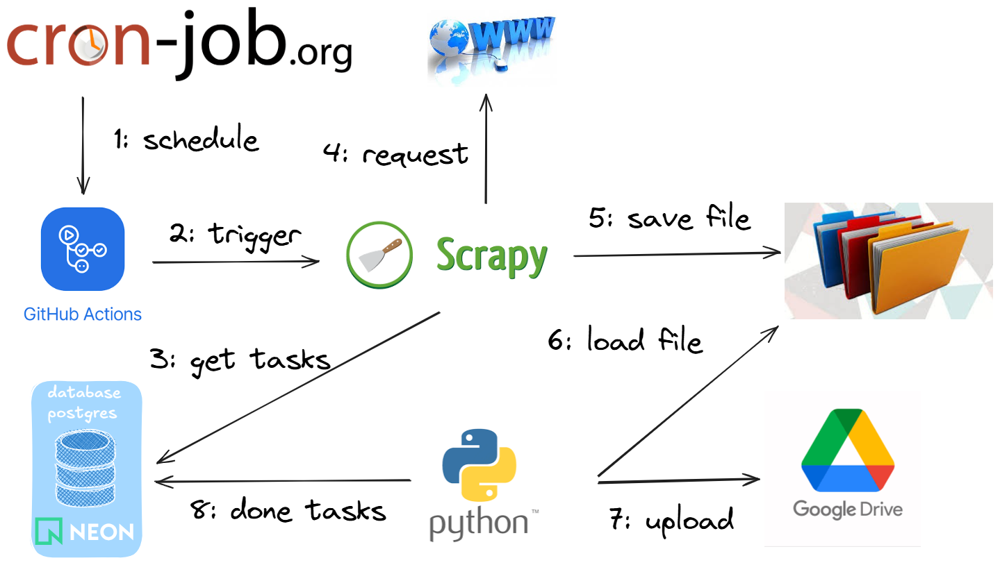
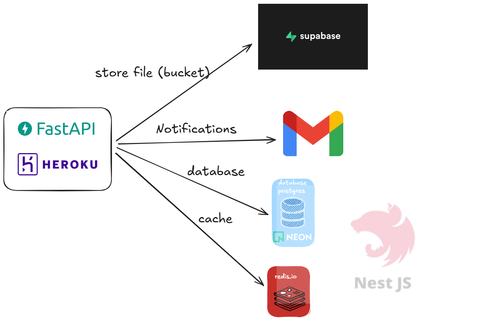

# Tổng quan kiến trúc hệ thống

## Sơ đồ quản lý secret bằng doppler

## Sơ đồ CICD bằng Github Action

<!-- ## Sơ đồ quản lý Kong API Gateway -->

<!--  -->

<!-- ## Sơ đồ Infrastructure as Code (IaC) sử dụng terraform -->

<!--  -->

## Sơ đồ Data Pipeline

<!-- Data Source -->

<!-- crawl-data -->

<!-- Staging Area -->

<!-- ETL -->

<!-- Destination -->

## Sơ đồ thu thập dữ liệu

## Sơ đồ tiền xử lý dữ liệu ETL

- [ ] Trích xuất nội dung thẻ HTML

- [ ] Trích xuất nội dung tiêu đề số liệu, số văn bản, thời gian vị trí bên trên

- [ ] Trích xuất nội dung người ký bên dưới

- [ ] Chuyển đổi ngày tháng năm

- [ ] Trích xuất nội dung quan trọng ở giữa

- [ ] Sử dụng python để chuyển thành markdown

- [ ] Sử dụng langchain : Chunking và embeddings dữ liệu

## Sơ đồ Tổng quan chung về backend AI

<!-- Backend và AI cùng chung 1 dự án, sau này có thể tách thành 1 backend hoặc microservice NestJS (dự kiến) -->

<!--  -->

