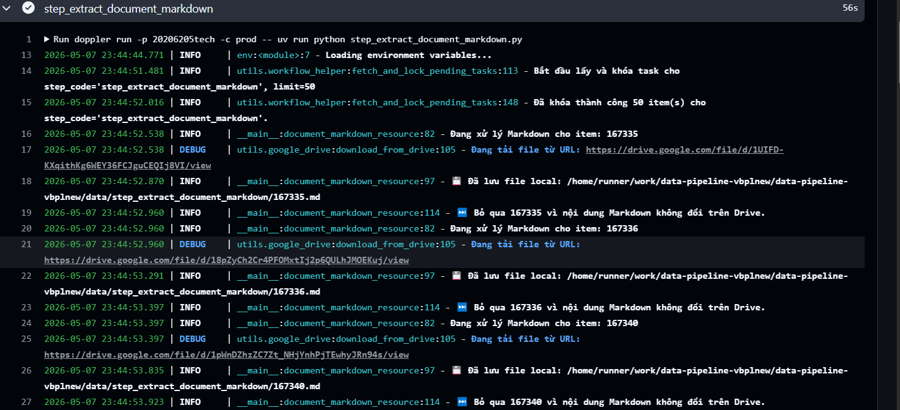
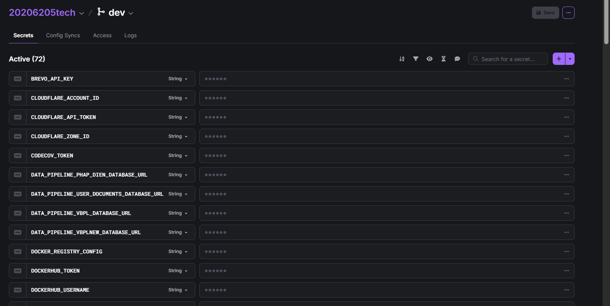
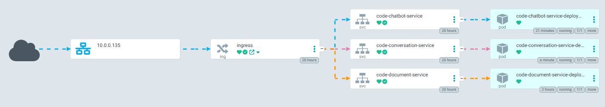
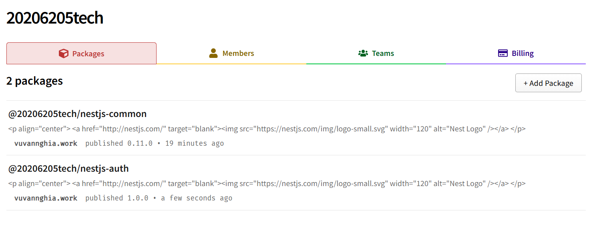
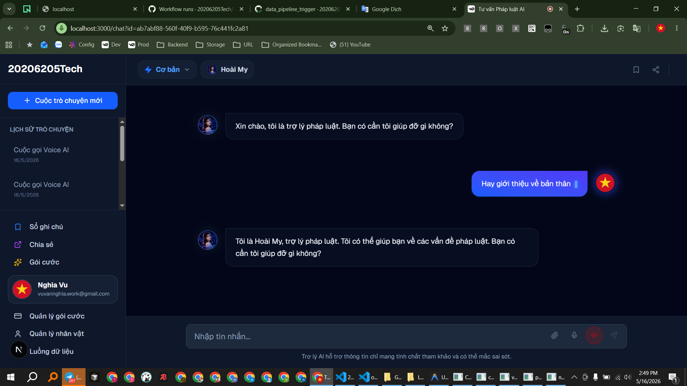
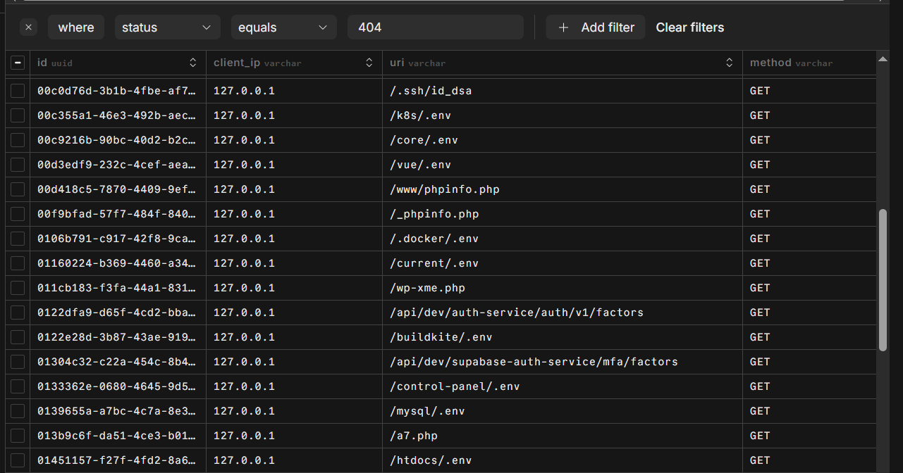
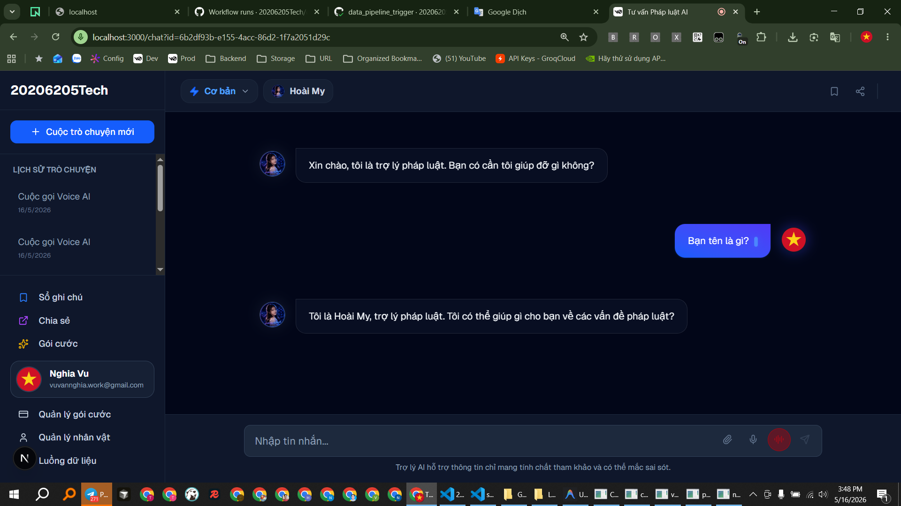
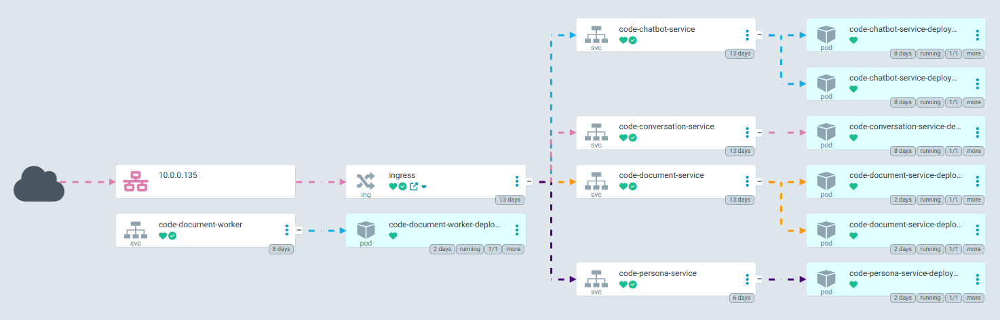

<!-- Tải xuống file pdf trò chuyện??? -->
<!-- - [ ] Chức năng Tra cứu???? -->
<!-- GraphQL -->
<!-- Không có chức năng giảm giá => Nhiều người mua cùng lúc -->
<!-- Không có chức năng hủy gói -->
<!-- Không có chức năng tự động gia hạn vì phụ thuộc cổng thanh toán -->
<!-- Chức năng tìm kiếm văn bản -->
<!-- Chức năng tìm kiếm lịch sử chat -->
<!-- Dùng google trend để tạo câu hỏi theo thông tin hiện tại (Ko) -->

# ==========================================

<!-- Giao diện chương trình -->

<!--  -->

https://testcontainers.com

# ==========================================

- [x] Tạo gói common: 20206205tech-nestjs-common
- [ ] Vẽ sơ đồ có gói common

- [x] Tự động cập nhật thư viện hàng ngày dependabot

- [x] Thêm tracing với honeycomb

- [x] Sử dụng docker, kubernetes, ... => Tạo gitops với argocd

- [x] ADMIN ít query truy vấn, ổn định url cố định => vercel
- [x] Tạo vbplnew và vbplnew service
- [x] Tạo pháp điển và pháp điển service

- [x] Do doc có AI đơn giản nên dùng langfuse

- [x] Cố định loại cổng thanh toán để Demo và DDD chỉ cần Iterface : demo-payment-ddd + swagger + heroku + demo

- [x] Chức năng RAG đơn giản, suy luận (use_reasoning)

- [ ] Xem thêm folder docs của các REPO vào báo cáo

<!-- Phân trang cho tất cả API và giao diện (hàm phân trang chung) -->

<!-- Tạo sơ đồ của  terraform -->

- [x] Do dùng miễn phí nên Neon không đủ, bị giới hạn => đổi qdrant và neon => thay đổi pháp điển dùng qdrant và user docs dùng neon, Chuyển database vbpl sang digitalocean
- [x] phapdien trong step_download_zip có zip_check

- [ ] CÀI ĐẶT: Thêm âm thanh trả lời auto_play_audio=false, true

- [x] Xoay vòng các url: 20206205.work.gd, toeic.work.gd, hust.work.gd

- [x] Xử lý cảnh báo Redis BullMQ (IMPORTANT! Eviction policy is volatile-lru. It should be "noeviction") => chỉnh Redis thành noeviction và xóa task bằng code

<!-- - [x] bullMQ thì đã có và Celery  -->
<!-- đồng thời thêm cơ chế kích hoạt Retry (thử lại) khi có lỗi xảy ra. -->
<!-- Không dùng background task nữa. Sử dụng Celery với REDIS_URL = env.str("REDIS_URL") để độc lập và scale hệ thống dễ dàng mở rộng -->

- [x] Xem kỹ lại các cổng thanh toán
- [x] Quay lại Màn giao diện thanh toán thành công
- [x] Nếu người dùng mua nhiều lần => cộng dồn ngày

- [x] Xem kỹ về DDD và Viết test

<!-- Lý thuyết  DOMAIN DRIVEN DESIGN => Cấu trúc thư mục dự án -->
<!-- Viết qui định nghiệp vụ DDD -->

<!-- Test API: unit test, test container, ... và test AI Ragas -->

<!-- test ai, api, unit, e2e, automation, ... -->

<!-- sơ đồ tuần tự, luồng đi, các chức năng quan trọng vì các Microservice  -->

<!-- Kiểm tra số tiền -->

<!-- Nếu thông báo gửi 2 lần thì hệ thống có cơ chế xử lý không??? Hoặc Nếu Hacker Gửi thanh toán? -->

- [x] doc-service xử lý FILE dùng database Milvus

# ==========================================

<!-- QUEUE: RABBITMQ_URL: chat_deletions, Chưa có phân biệt dev prod -->
<!-- Sự kiện phải được đánh phiên bản là số thứ tự -->
<!-- Sự kiện phải được đánh phiên bản là số thứ tự -->
<!-- Bị ngược rabbit, kafka vì người dùng mua ít, dùng doc nhiều -->
<!-- @contextScopeItemMention @contextScopeItemMention Tôi muốn   dựa vào RabbitMqAdapter -->

<!-- Thêm phần nếu Queue bị lỗi => cần xử lý lại -->

Chụp ảnh database vector
Chụp 2 loại database

<!-- Vẽ cả LangSmith và  Langfuse trong AI -->

# ==========================================

- [ ] gRPC làm xong thì mới thành thư viện
- [ ]        Thiết lập Kong truyền thêm một Header bí mật (ví dụ: X-Gateway-Auth) thì mới cho gọi request
- [ ] Chức năng TOTP do nội dung pháp luật cần bảo vệ (TOTP làm xong thì mới thêm vì thêm bước) https://gemini.google.com/app/a33cd53e27c33d50

- [ ] code-persona-service
- [ ] Nguồn Văn bản tiếng anh, (Sự phức tạp không chỉ nằm ở khối lượng dữ liệu, mà các văn bản có thể thay thế, bổ sung, hết hiệu lực, ...)

- [ ] csrf
- [ ] CORS

# ==========================================

- [ ] Xử lý các định dạng file khác nhau => RAG

- [ ] Câu bắt đầu của nhân vật
- [ ] Thống nhất shared-chats, shared-link, Chỉnh thành share

# ==========================================

<!-- Kong API Gateway  -->
<!-- AI đã trả lời xong nhưng giao diện vừa trả lời vừa có suy nghĩ "Đang kiểm tra câu trả lời"?? -->
<!-- KHi trả lời quá lâu thì vẫn bị lỗi=> Kong API Gateway dùng Free -->

# ==========================================

Người dùng nhắc đến văn bản pháp luật thì mới check

Chức năng Dashboard của ADMIN???
admin quản lý thanh toán và kích hoạt thủ công
Giao diện admin thanh toán thủ công như thế nào ?
Tìm kiếm theo id giao dịch, user, ....

Pytest

Cộng dồn thanh toán

Tôi có nên chỉnh lại BaseVersionAggregateRoot trong common không cần version để đỡ phức tạp???

Chức năng voice và **Persona** Service

<!-- doc Dùng cả markdown và docling -->

<!-- - [ ] Thay thế 2 space INPUT của người dùng Và Đếm text để giới hạn INPUT (VIP) + check api (=> lắng nghe event) -->

<!-- from fastapi import BackgroundTasks tạo topic và lập lịch tóm tắt lịch sử -->

<!-- Giao diện Flower Celery và BullMQ admin -->

Gói auth python, nestjs vì auth service supabse => tiện, không lặp code

<!-- vietnamese-sbert -->

Khi chia doc service => doc nhẹ GET thoải mái và doc không cần AI nữa
Vẽ cả RAG langchain-text-splitters tương tư Data pipeline

<!-- Nếu tải lên file bị lỗi thì gọi api thử lại (retry) -->

<!-- Tải lên file thì giao diện chờ lâu mới hiển thị đang tải lên -->

Ấn new chat nhưng vẫn hiện file của chat cũ???
Khi ấn nút new chat phải gọi api /start?

<!-- Bộ ngắt mạch -->

Không thể retry tài liệu đang ở trạng thái: PROCESSING, COMPLETED

<!-- @20206205tech/nestjs-auth => Mục đích là chia tách nhỏ phần auth ra gói riêng. Gói auth hỗ trợ các service khác auth, tái sử dụng. chỉ cần tập trung logic. Dễ thay đổi -->

<!-- Lắng nghe sự kiện thanh toán => voice, suy luận -->
<!-- Pesona không cần nghe event vì livekit phải có thêm api key, người dùng không biết để kết nối -->

<!-- HUST => không google: Đăng ký, email xác nhận, Đăng nhập, quên mật khẩu  -->

<!-- Chụp ảnh mail -->

Chụp ảnh reids

Nhiều giấy tờ văn bản khó tiếp cận

người già cần voice
người trẻ cần voice

demo mail

<!-- load ai tương tự 1 lần -->

<!-- sử dụng thuật toán LRU (Least Recently Used) -->
