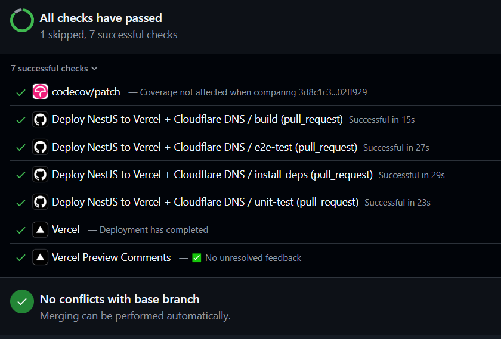
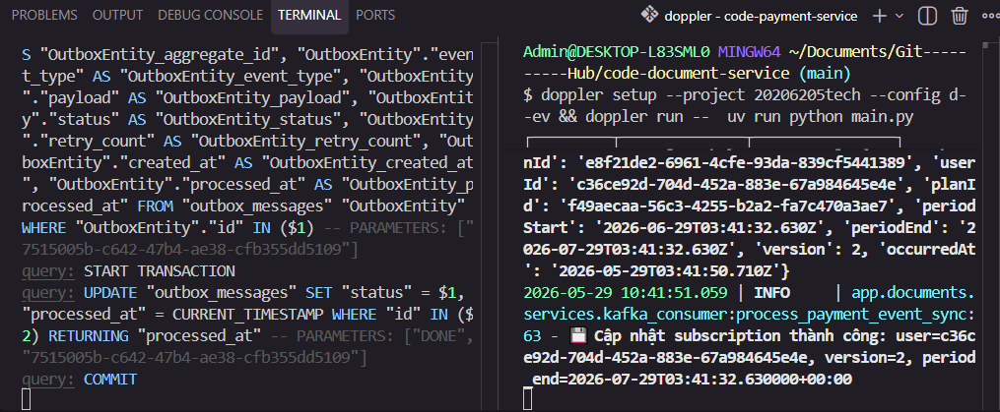
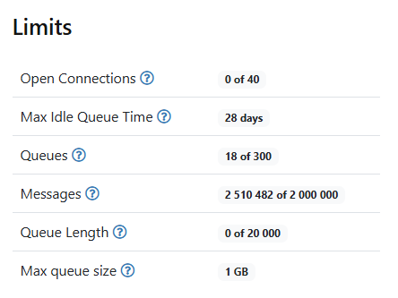
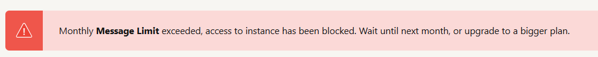
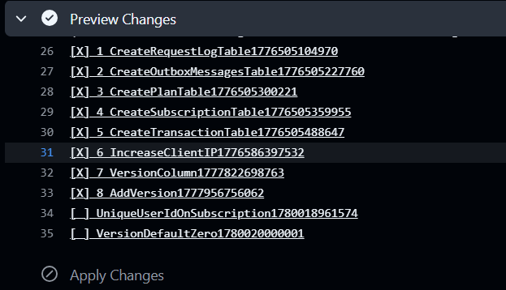
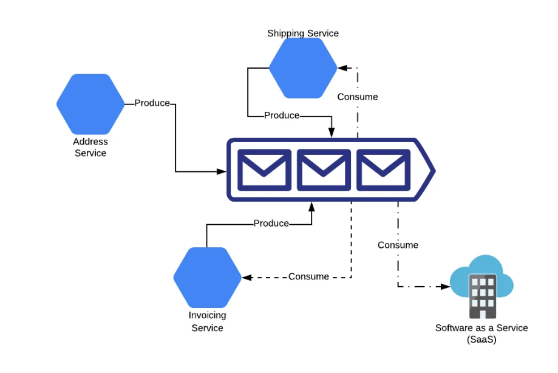
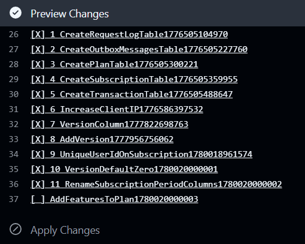

<!-- Ngắt lời -->
<!-- Ở chế độ nói voice.  -->

<!-- - **`agent_false_interruption` / `overlapping_speech**`: Xảy ra khi hệ thống nhận diện việc ngắt lời (người dùng nói xen vào khi AI đang nói). -->

<!-- Hướng dẫn ứng dụng -->

<!-- agent_false_interruption -->
<!-- overlapping_speech -->
<!-- => dừng RAG -->

<!-- Tôi hỏi câu hỏi thứ nhất, ngắt lời hỏi cầu hỏi thứ 2.  -->

<!-- cd ~/Documents/GitHub/docs-markdown && code . -->

<!-- Khả năng đợi xác nhận: text, voice  -->
<!-- "Xác nhận", trong đó khách hàng gửi một chuỗi dữ liệu cụ thể để buộc tổng đài viên bắt đầu xử lý giọng nói -->
<!-- Nút xác nhận continue -->
<!-- Xác nhận bằng câu nói -->

<!-- ! -->

cron và redis : dùng domain, application

<!-- kafka? -->
<!-- Sự kiện... cộng dồn => chỉ lưu update -->
<!-- Queue lỗi gửi lỗi nhận -->

SAGA

Event scouicng

<!-- Kong 1 2 = key, request id -->
<!-- # if env.ENVIRONMENT == "development": => không cần request id -->
request-kong-secret
request-id

<!-- RAGAs chịu -->

<!-- Quay video demo -->

<!-- Nguồn dữ liệu, Tài nguyên api, VPS -->

<!-- INPUT, state lang, voice -->

<!-- F5 mất xác nhận -->

<!-- Khi chat xong, dùng voice luôn => Câu trả lời stream không đúng -->

Khi dùng voice, Không thấy xử lý xác nhận voice??

Khi dùng voice, avatar của AI không có? => Sau đó khi RAG trả lời xong bị thành 2 câu trả lời giống nhau, câu trả lời 1 có phần suy luận, câu trả lời 2 không có phần suy luận

https://github.com/20206205Tech/code-conversation-service/tree/main/docs

https://github.com/20206205Tech/code-payment-service/tree/main/docs

https://kafka.apache.org/43/design/design/#message-delivery-semantics

https://microservices.io/patterns/data/transactional-outbox.html

https://martinfowler.com/articles/201701-event-driven.html

Github action=> tele telegram

payment => kafka, redis... heroku

<!-- Chụp phần giao diện tài khoản mới chưa có lịch sử chat -->

Vẽ hình version +1

Trong một số trường hợp nếu văn bản hết hiệu lực thì con người có thể chưa kịp cập nhật thông tin.
