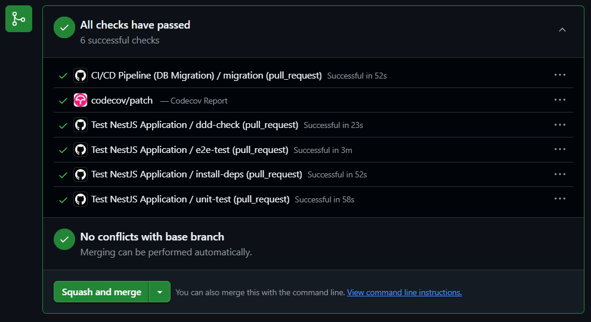
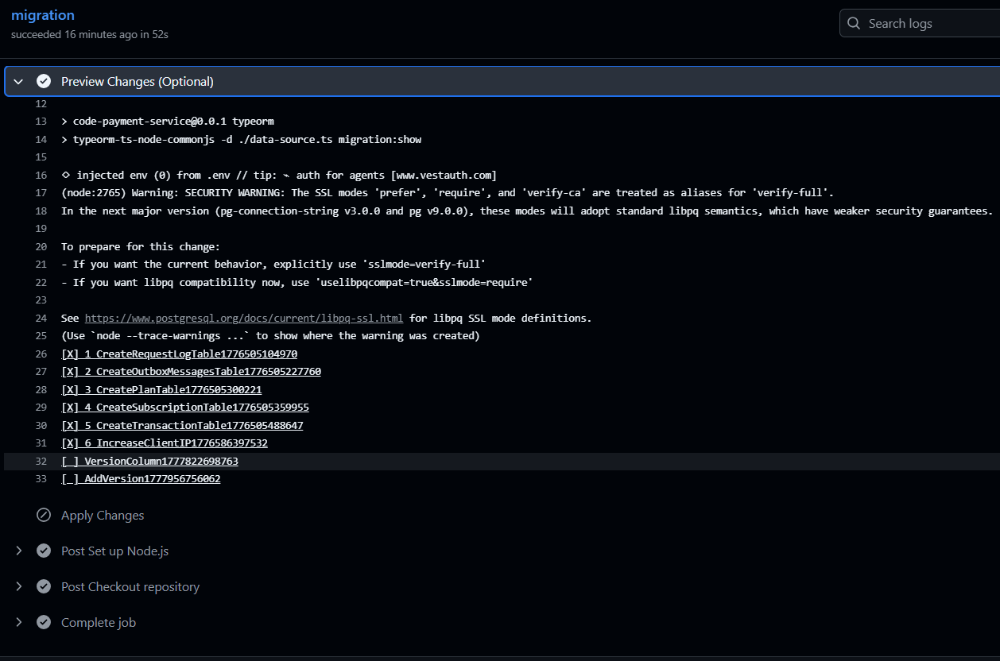
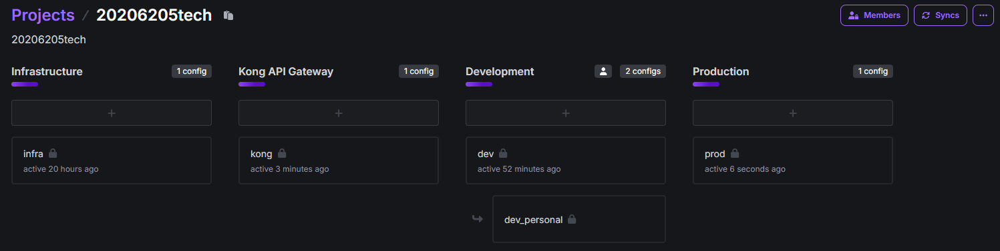

- [x] Tạo gói common: 20206205tech-nestjs-common
<!-- =>Vé hình -->

- [x] Thêm tracing với honeycomb

- [x] Sử dụng docker, kubernetes, ...Tạo gitops với argocd
- [x] Tạo vbplnew và vbplnew service
  <!-- dependabot -->
  <!-- Thêm âm thanh auto_play_audio=false, true -->

<!-- Thêm pháp điển service -->

<!-- - [ ] Thay thế 2 space INPUT của người dùng Và Đếm text để giới hạn INPUT (VIP) + check api (=> lắng nghe event) -->

<!-- RABBITMQ_URL: chat_deletions, Chưa có phân biệt dev prod -->

<!-- Thêm phần nếu Queue bị lỗi => cần xử lý lại -->

<!-- Test API: unit test, test container, ... và test AI Ragas -->

<!-- test ai, api, unit, e2e, automation, ... -->

<!-- Phân trang cho tất cả -->

<!-- Tải xuống file pdf trò chuyện??? -->
<!-- - [ ] Chức năng Tra cứu???? -->
<!-- Chức năng Dashboard của ADMIN??? -->

<!-- Dùng google trend để tạo câu hỏi theo thông tin hiện tại -->

<!-- Tạo sơ đồ terraform -->

- [x] Do dùng miễn phí nên Neon không đủ, bị giới hạn => đổi qdrant và neon => thay đổi pháp điển dùng qdrant và user docs dùng neon, Chuyển database vbpl sang digitalocean
- [x] phapdien trong step_download_zip có zip_check

<!-- -->

gh repo delete --yes 20206205Tech/docs-2026_05_05

<!-- -->

- [x] Tự động cập nhật thư viện hàng ngày
- [x] Xem kỹ về DDD và Viết test
- [x] Xem kỹ lại các cổng thanh toán
- [x] Nếu người dùng mua nhiều lần => cộng dồn ngày

<!-- doc Dùng cả markdown và docling -->

<!-- Sự kiện phải được đánh phiên bản là số thứ tự -->

- [x] Quay lại Màn giao diện thanh toán thành công

<!-- Bị ngược rabbit, kafka vì người dùng mua ít, dùng doc nhiều -->
<!-- @contextScopeItemMention @contextScopeItemMention Tôi muốn bạn dựa vào RabbitMqAdapter -->

VPS mới => Cấu hình lại k8s

<!-- Nếu thông báo gửi 2 lần thì hệ thống có cơ chế xử lý không??? -->
<!-- Nếu Hacker Gửi thanh toán? -->

<!-- Chức năng voice và **Persona** Service -->

<!-- Giao diện admin thanh toán thủ công như thế nào ? -->

new Error
new NotFoundException

Kiểm tra số tiền

Tôi có nên chỉnh lại BaseVersionAggregateRoot trong common không cần version để đỡ phức tạp???

<!-- Lý thuyết  DOMAIN DRIVEN DESIGN => Cấu trúc thư mục dự án -->
<!-- sơ đồ tuần tự luồng đi -->

Tôi thấy code-payment-service có 293 thay đổi trên github nhưng code-conversation-service chỉ có 192?

<!-- hình tách microservice  -->

Cộng dồn thanh toán

<!-- Viết qui định nghiệp vụ DDD -->

https://testcontainers.com

GraphQL
gRPC
Pytest

Xử lý các định dạng file khác nhau => RAG

Giao diện chương trình
G:\My Drive\contents\New folder (2)\Sau báo cáo lần 1

<!-- Sự phức tạp không chỉ nằm ở khối lượng dữ liệu, mà các văn bản có thể thay thế, bổ sung, hết hiệu lực, ... -->

admin quản lý thanh toán và kích hoạt thủ công

Tìm kiếm theo id, user, ....

Key Kong API Gateway thì mới cho gọi request response result
thiết lập Kong truyền thêm một Header bí mật (ví dụ: X-Gateway-Auth)

BuG:

Người dùng nhắc văn bản pháp luật thì mới check
AI đã trả lời nhưng giao diện vừa trả lời vừa có suy nghĩ "Đang kiểm tra câu trả lời"??

Chức năng TOTP do nội dung pháp luật cần bảo vệ

KHi trả lời quá lâu thì vẫn bị lỗi=> Kong API Gateway

<!-- Chức năng tìm kiếm văn bản -->

<!-- Cố định loại cổng thanh toán -->

shared-chats, shared-link, Chỉnh thành share

<!-- Xoay vòng các url: 20206205.work.gd, toeic.work.gd, hust.work.gd   -->

<!-- admin ít truy vấn, ổn định url cố định => vercel-->

<!-- Xử lý cảnh báo Redis BullMQ -->
<!-- chỉnh Redis thành noeviction -->
<!-- IMPORTANT! Eviction policy is volatile-lru. It should be "noeviction" -->

[text](../../../code-payment-service/docs/README.md)

<!-- use_reasoning -->

<!-- demo-payment-ddd + heroku + swagger + demo -->

<!-- Do doc đơn giản nên dùng langfuse -->

<!-- Sự kiện phải được đánh phiên bản là số thứ tự -->

Câu bắt đầu

zilliz=> Milvus

<!-- bullMQ đã có và Celery sau -->
<!-- gRPC làm xong thì mới thư viện =>  -->
<!-- code-persona-service -->
<!-- Nguồn Văn bản tiếng anh -->
<!-- csrf -->
<!-- CORS  -->

<!-- Không có chức năng giảm giá -->
<!-- Không có chức năng hủy gói -->
<!-- Không có chức năng tự động gia hạn vì phụ thuộc cổng thanh toán -->
