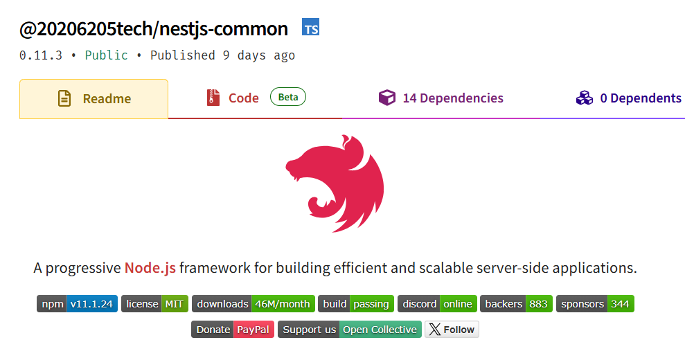
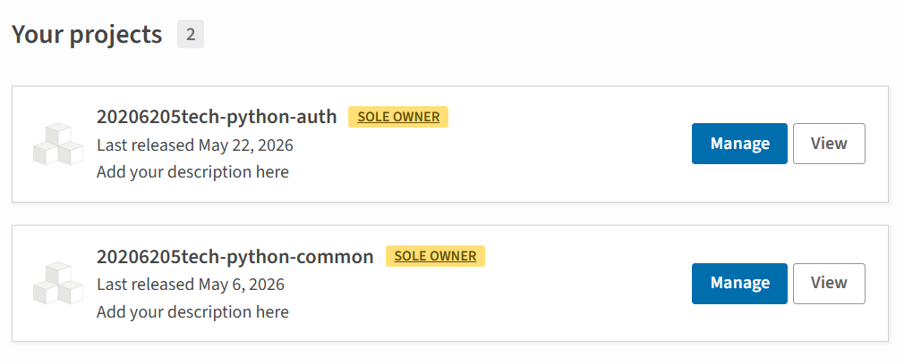
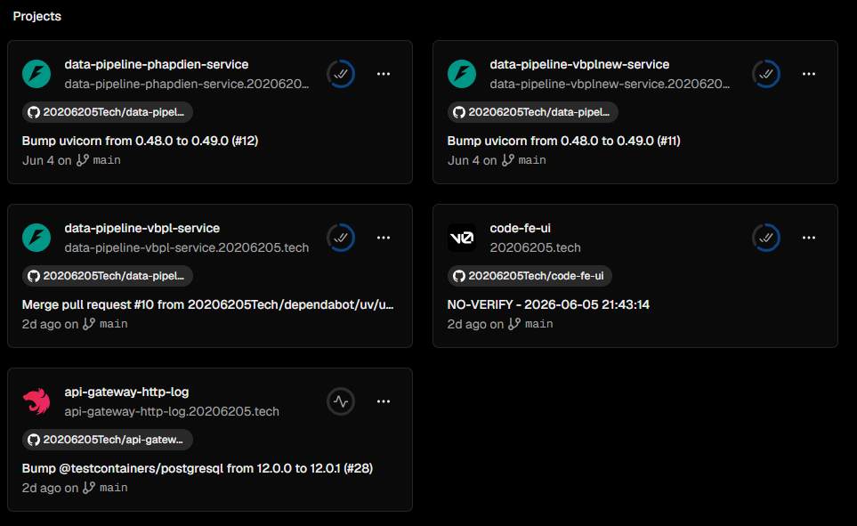
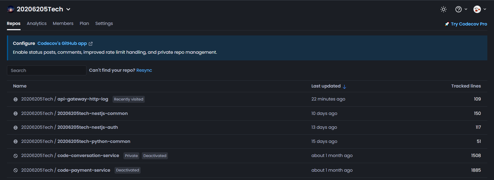

terraform

npm sssssssssssss

gói npm và   python

## Cấu hình trong Kong API Gateway

Tạo services có url là https://[PROJECT_REF].supabase.co
Tạo routes có paths[] là /api/dev/supabase và /api/prod/supabase
Tạo request-transformer có header=apikey:...

<!-- thiết kế database  -->
<!-- Các sơ đồ database -->

<!-- api swagger -->
<!-- ## Cấu hình trong Kong API Gateway -->

<!-- database migration -->
<!-- github action -->

<!--  -->

<!--  -->

